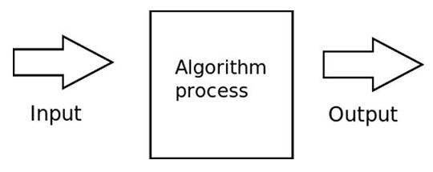
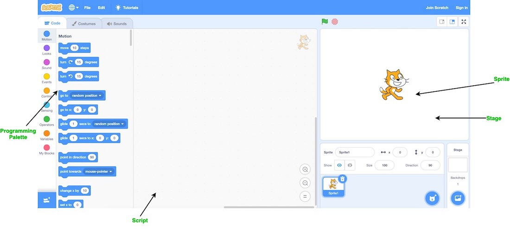

# Scratch

# Intro

Before going into Scratch, we will briefly elucidate on other topics to be covered later in this course.

# Pseudocode

**Pseudocode** refers to the translation of something verbal into a code format e.g.

Pseudocode to search a name on a phonebook:

- Pickup phone book
- Open to middle of page
- Look at page
- If person is on page
    - Call person
- Else if person is earlier in book
    - Open to middle of the left half of the book
    - Go back to line 3
- Else if person is later in the book
    - Open to middle of the right half of the book
    - Go back to line 3
- Else
- Quit.

🟠Functions

🟢Conditionals

🔵Loops

# Functions

**Functions** refer to commands/actions you want your program to perform. It’s the implementation of an algorithm.

# Conditionals

**Conditionals** are statements or expressions that perform different actions based on whether a specific condition is True or False. 

# Loops

**Loops** are constructs that allow you to repeatedly execute a block of code as long as a specified condition is met. It is a cycle that results in doing the same thing again and again.  There are different types of loops in programming (`for` loops, `while` loops, `do` `while` loops) which will be elaborated on in other chapters.

# Algorithm and Abstraction

An **algorithm** is a step by step instructions for solving problems.

An **abstraction** is the simplification of something so the lower level implementation details are not focused on. It does not follow the rule of precision. It consists of an algorithm.

# Arguments and Parameters

**Arguments** are inputs to a function that modifies its behavior in a certain way. They are the actual values passed to the function when you invoke it. They provide the actual input that the function uses to perform its operations. They are usually found in parenthesis when a function is called.

**Parameters** act as placeholders to these arguments when the function is defined. They are usually found in parenthesis when a function is defined.

# Event

An **Event** is something graphical that just happens in a computer program. We trigger events on our devices when we click, drag etc., and the companies which build these devices implement code which react with events when a particular thing happens.

# Scratch

**Scratch** is a visual programming language that allows users to create their own interactive stories, games and animations.

## Elements of scratch

There are four main elements of Scratch: the stage, the sprites, the script and the programming palette:

- **Stage:** similar to the stage in a play. This is where everything will take place. The stage can be different backgrounds just like in a play.
- **Sprite:** are scratch characters that respond to code.
- **Script:** tells the actors what to say or do. Each sprite is programmed with a script.
- **Programming palette:** elements used to program the sprite to do or say something. Sprites
must be programmed to carry out every function you want them to perform.

Elements of scratch.